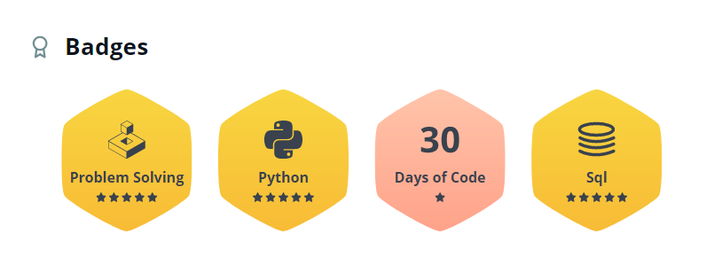
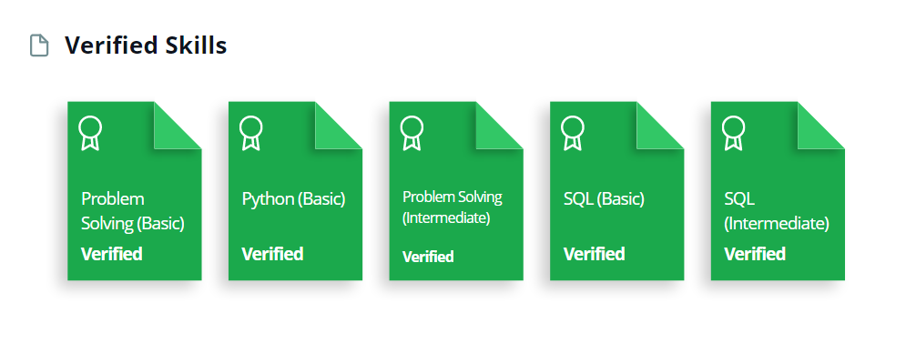

<h1 align="center">Hi 👋, I'm Haydar!</h1>

- 📄 Know about my experiences via my [Website](https://haydarevren.com) and [LinkedIn page](https://www.linkedin.com/in/haydar-evren/)

- 📫 Don't hesitate to touch with me on **haydaremin@gmail.com**

<h3 align="center">Connect with me:</h3>

<h3 align="center">Languages and Tools:</h3>

 

 
 
  
   
   

  

<h3 align="center">Some Stats:</h3>

 

  
  
  
  
  
  
  

<!--
**haydarevren/haydarevren** is a ✨ _special_ ✨ repository because its `README.md` (this file) appears on your GitHub profile.

Here are some ideas to get you started:

- 🔭 I’m currently working on ...
- 🌱 I’m currently learning ...
- 👯 I’m looking to collaborate on ...
- 🤔 I’m looking for help with ...
- 💬 Ask me about ...
- 📫 How to reach me: ...
- 😄 Pronouns: ...
- ⚡ Fun fact: ...
-->
